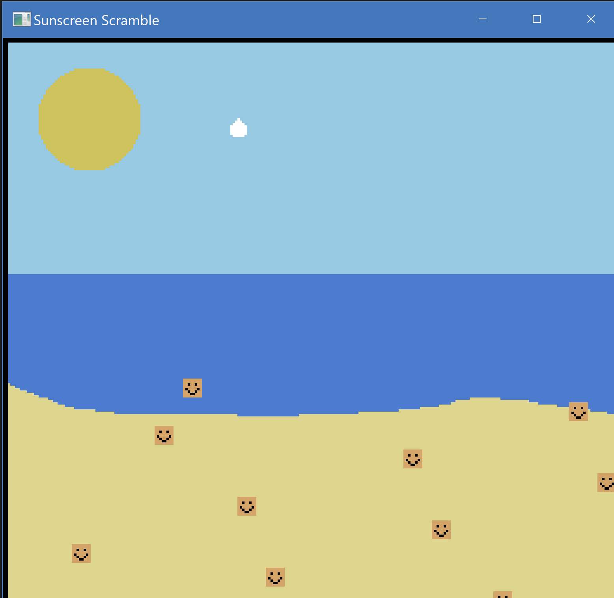

Sunscreen Scramble

Author: Mandy Hu

Design: My game is a spin of a classic shooter, game, but themed around sunscreen
        in order to remind everyone of the importance of wearing suncreen when going outside.

Screen Shot:

How Your Asset Pipeline Works:
1) Source files are added into the dist file so that they are accessible by data_path()
2) In load_assets.py, each of the source images are loaded in through a python command and
   inputted into a function which creates palettes and tiles
3) The images are turned into bytes. The background is split into 8x8 tiles, and the tiles
   are added into a dictionary where the key is the tile bytes. The sprites are also added
   into the tile dictionary (they are already 8x8). Only unique tiles are added into the dict
4) For each tile in the dictionary, we loop through each pixel and add the color of the pixel 
   to a set to prevent duplicates in each palette. We check that there are no more than 4 colors
   in a palette. The palettes are then added to another dictionary, still with the tile bytes as
   a key. This helps to pair the unique tiles to their individual keys
4) Duplicate palettes are removed, and the tile to palette dictionary is reorganized to accommodate
   for the removed palettes
5) The set of palettes is turned into a list, and a map is created mapping each tile key to the 
   index in the list of palettes that it is matched with in the dictionary
6) Palettes in the palette list are modified so that palettes with less than 4 colors in them
   have now all have 4 colors (filed with 0, 0, 0, 0)
7) The tile dictionary is recreated to include its index within the dictionary as part of a tuple
   within the value of the dictionary
8) An empty backgrounds list is created, and the 16 bit value for every member of the list is 
   drived by bit-shifting the palette index and tile index into their appropriate places. The backgrounds
   list is then flipped "upside down" since the PPU loads each tile starting from the bottom left 
9) An empty palette table is created and all the palettes from the palettes list is shifted in
10) An empty tile table is created, and for each bit in each tile, we find the corresponding bits
    that we use to identify which color in the palette corresponding to that tile to use.
11) tile_table, background, and palette_table are outputted in to a new directory as .bin files
    and then loaded in the PPU466

Source files are uploaded in "/dist/assets"

How To Play:

To start the game, use either of the two arrow keys to move your avatar (the drop of sunscreen).
Press space to squeeze a drop of sunscreen out.
The goal of the game is to "rub" sunscreen on each of faces moving on the screen.
Once you hit a face with the sunscreen, it will disappear off of the screen.
Make all of the faces disappear to win the game.

This game was built with [NEST](NEST.md).
